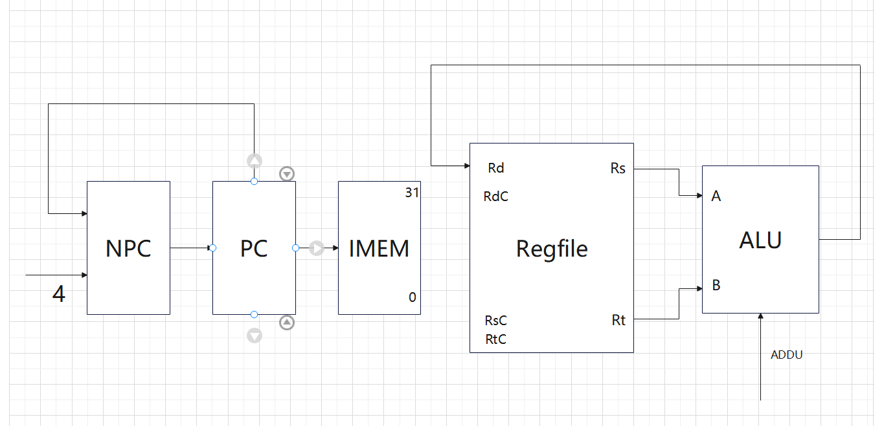
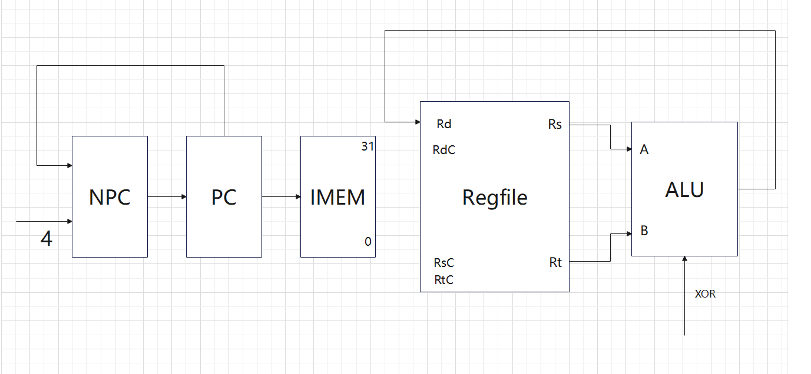

### R型指令

ADD

PC$\rightarrow$IMEM
PC+4$\rightarrow$NPC
NPC$\rightarrow$PC

Rs$\rightarrow$A,Rt$\rightarrow$B
RES$\rightarrow$Rd

ADDU

PC$\rightarrow$IMEM
PC+4$\rightarrow$NPC
NPC$\rightarrow$PC

Rs$\rightarrow$A,Rt$\rightarrow$B
RES$\rightarrow$Rd

SUB

PC$\rightarrow$IMEM
PC+4$\rightarrow$NPC
NPC$\rightarrow$PC

Rs$\rightarrow$A,Rt$\rightarrow$B
RES$\rightarrow$Rd

SUBU

PC$\rightarrow$IMEM
PC+4$\rightarrow$NPC
NPC$\rightarrow$PC

Rs$\rightarrow$A,Rt$\rightarrow$B
RES$\rightarrow$Rd

AND

PC$\rightarrow$IMEM
PC+4$\rightarrow$NPC
NPC$\rightarrow$PC

Rs$\rightarrow$A,Rt$\rightarrow$B
RES$\rightarrow$Rd

OR

PC$\rightarrow$IMEM
PC+4$\rightarrow$NPC
NPC$\rightarrow$PC

Rs$\rightarrow$A,Rt$\rightarrow$B
RES$\rightarrow$Rd

XOR

PC$\rightarrow$IMEM
PC+4$\rightarrow$NPC
NPC$\rightarrow$PC

Rs$\rightarrow$A,Rt$\rightarrow$B
RES$\rightarrow$Rd

NOR

PC$\rightarrow$IMEM
PC+4$\rightarrow$NPC
NPC$\rightarrow$PC

Rs$\rightarrow$A,Rt$\rightarrow$B
RES$\rightarrow$Rd

SLT

PC$\rightarrow$IMEM
PC+4$\rightarrow$NPC
NPC$\rightarrow$PC

Rs$\rightarrow$A,Rt$\rightarrow$B
RES$\rightarrow$EXT1
EXT1_out$\rightarrow$Rd

SLTU

PC$\rightarrow$IMEM
PC+4$\rightarrow$NPC
NPC$\rightarrow$PC

Rs$\rightarrow$A,Rt$\rightarrow$B
RES$\rightarrow$EXT1
EXT1_out$\rightarrow$Rd

SLL

PC$\rightarrow$IMEM
PC+4$\rightarrow$NPC
NPC$\rightarrow$PC

shamt$\rightarrow$EXT5
EXT5_out$\rightarrow$A,Rt$\rightarrow$B
RES$\rightarrow$Rd

SRL

PC$\rightarrow$IMEM
PC+4$\rightarrow$NPC
NPC$\rightarrow$PC

shamt$\rightarrow$EXT5
EXT5_out$\rightarrow$A,Rt$\rightarrow$B
RES$\rightarrow$Rd

SRA

PC$\rightarrow$IMEM
PC+4$\rightarrow$NPC
NPC$\rightarrow$PC

shamt$\rightarrow$EXT5
EXT5_out$\rightarrow$A,Rt$\rightarrow$B
RES$\rightarrow$Rd

SLLV

PC$\rightarrow$IMEM
PC+4$\rightarrow$NPC
NPC$\rightarrow$PC

Rs$\rightarrow$EXT5
EXT5_out$\rightarrow$A,Rt$\rightarrow$B
RES$\rightarrow$Rd

SRLV

PC$\rightarrow$IMEM
PC+4$\rightarrow$NPC
NPC$\rightarrow$PC

Rs$\rightarrow$EXT5
EXT5_out$\rightarrow$A,Rt$\rightarrow$B
RES$\rightarrow$Rd

SRAV

PC$\rightarrow$IMEM
PC+4$\rightarrow$NPC
NPC$\rightarrow$PC

Rs$\rightarrow$EXT5
EXT5_out$\rightarrow$A,Rt$\rightarrow$B
RES$\rightarrow$Rd

JR

PC$\rightarrow$IMEM
PC+4$\rightarrow$NPC 无关操作
NPC$\rightarrow$MUX 无关操作

Rs$\rightarrow$MUX
MUX_out$\rightarrow$PC

### I型指令

ADDI

PC$\rightarrow$IMEM
PC+4$\rightarrow$NPC
NPC$\rightarrow$PC

Immediate$\rightarrow$EXT16
EXT16_out$\rightarrow$B
Rs$\rightarrow$A
RES$\rightarrow$Rd

ADDIU

PC$\rightarrow$IMEM
PC+4$\rightarrow$NPC
NPC$\rightarrow$PC

Immediate$\rightarrow$EXT16
EXT16_out$\rightarrow$B
Rs$\rightarrow$A
RES$\rightarrow$Rd

ANDI

PC$\rightarrow$IMEM
PC+4$\rightarrow$NPC
NPC$\rightarrow$PC

Immediate$\rightarrow$EXT16U
EXT16U_out$\rightarrow$B
Rs$\rightarrow$A
RES$\rightarrow$Rd

ORI

PC$\rightarrow$IMEM
PC+4$\rightarrow$NPC
NPC$\rightarrow$PC

Immediate$\rightarrow$EXT16U
EXT16U_out$\rightarrow$B
Rs$\rightarrow$A
RES$\rightarrow$Rd

XORI

PC$\rightarrow$IMEM
PC+4$\rightarrow$NPC
NPC$\rightarrow$PC

Immediate$\rightarrow$EXT16U
EXT16U_out$\rightarrow$B
Rs$\rightarrow$A
RES$\rightarrow$Rd

LW

PC$\rightarrow$IMEM
PC+4$\rightarrow$NPC
NPC$\rightarrow$PC

Immediate$\rightarrow$EXT16U
EXT16U_out$\rightarrow$B
Rs$\rightarrow$A
RES$\rightarrow$DMEM_addr
DMEM_out$\rightarrow$Rd

SW

PC$\rightarrow$IMEM
PC+4$\rightarrow$NPC
NPC$\rightarrow$PC

Immediate$\rightarrow$EXT16U
EXT16U_out$\rightarrow$B
Rs$\rightarrow$A
Rt$\rightarrow$DMEM
RES$\rightarrow$DMEM_addr

BEQ

PC$\rightarrow$IMEM
PC+4$\rightarrow$NPC
NPC$\rightarrow$MUX

Immediate||02$\rightarrow$EXT18
EXT18_out$\rightarrow$ADD_A
NPC$\rightarrow$ADD_B
ADD_out$\rightarrow$MUX
MUX_out$\rightarrow$PC

RS$\rightarrow$A
RS$\rightarrow$B

BNE

PC$\rightarrow$IMEM
PC+4$\rightarrow$NPC
NPC$\rightarrow$MUX

Immediate||02$\rightarrow$EXT18
EXT18_out$\rightarrow$ADD_A
NPC$\rightarrow$ADD_B
ADD_out$\rightarrow$MUX
MUX_out$\rightarrow$PC

RS$\rightarrow$A
RS$\rightarrow$B

SLTI

PC$\rightarrow$IMEM
PC+4$\rightarrow$NPC
NPC$\rightarrow$PC

Immediate$\rightarrow$EXT16
EXT16_out$\rightarrow$B
Rs$\rightarrow$A

CF$\rightarrow$EXT1
EXT1_out$\rightarrow$Rd

SLTIU

PC$\rightarrow$IMEM
PC+4$\rightarrow$NPC
NPC$\rightarrow$PC

Immediate$\rightarrow$EXT16
EXT16_out$\rightarrow$B
Rs$\rightarrow$A

CF$\rightarrow$EXT1
EXT1_out$\rightarrow$Rd

LUI

PC$\rightarrow$IMEM
PC+4$\rightarrow$NPC
NPC$\rightarrow$PC

Immediate$\rightarrow$EXT16
EXT16_out$\rightarrow$B
RES$\rightarrow$Rd

### J型指令

J

PC$\rightarrow$IMEM
PC+4$\rightarrow$NPC
NPC$\rightarrow$MUX

PC[31:28]$\rightarrow$||_A
Address||02$\rightarrow$||_B
||_OUT$\rightarrow$MUX

MUX$\rightarrow$PC

JAL

PC$\rightarrow$IMEM
PC+4$\rightarrow$NPC
NPC$\rightarrow$MUX

PC$\rightarrow$ADD_A
8$\rightarrow$ADD_B
ADD_OUT$\rightarrow$Rd

PC[31:28]$\rightarrow$||_A
Address||02$\rightarrow$||_B
||_OUT$\rightarrow$MUX
MUX_OUT$\rightarrow$PC

